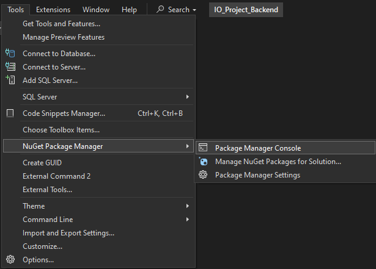
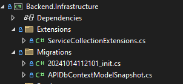
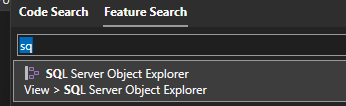
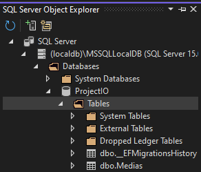

# IO_PROJECT_2024
CUPID

1. Aby wszystko działało tak jak chcecie, musicie na pewno mieć Backend.API jako projekt startowy:

2. Otwieramy konsole Nugeta:

3. Sprawdzamy czy mamy jakieś migracje w projekcie: 

    3.1. Jezeli nie mamy to tworzymy migracje w konsoli: `Add_Migration init`

4. Baza danych aktualnie jest na wbudowanym serwerze sql, który dostajemy podczas instalacji Visual Studio. Aby utworzyć baze danych na podstawie migracji wpisujemy w konsoli `update-database`

5. W wyszukiwarce mozemy poszukac domyslnej apki do zarzadzania bazą danych:

6. Powinniśmy widzieć nasza baze danych: 
