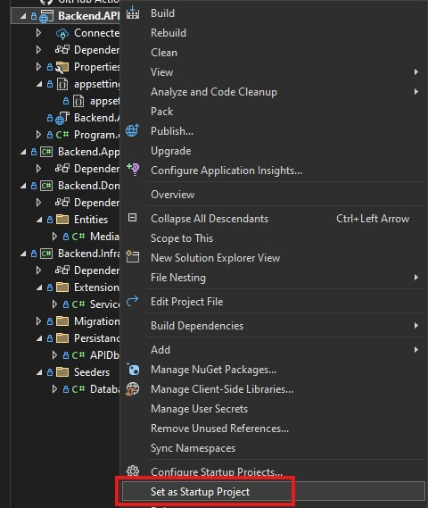

# IO_PROJECT_2024
CUPID

1. Aby wszystko działało tak jak chcecie, musicie na pewno mieć Backend.API jako projekt startowy:

2. Otwieramy konsole Nugeta:

4. Sprawdzamy czy mamy jakieś migracje w projekcie:
   

    3.1. Jezeli nie mamy to tworzymy migracje w konsoli: `Add_Migration init`

6. Baza danych aktualnie jest na wbudowanym serwerze sql, który dostajemy podczas instalacji Visual Studio. Aby utworzyć baze danych na podstawie migracji wpisujemy w konsoli `update-database`

7. W wyszukiwarce mozemy poszukac domyslnej apki do zarzadzania bazą danych:
   

9. Powinniśmy widzieć nasza baze danych:
    

